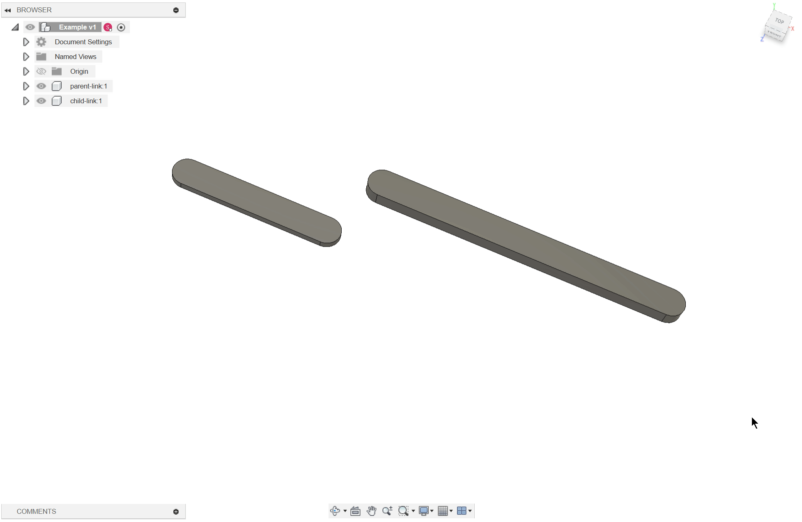

# Instructions for Fusion 360 Assembly
Currently, this add-in only tested for Fusion360 assemblies with a flatten structure (do not have nested components). Here we present instructions for assembling a robot in Fusion360 that is suitable for this add-in.

## Fusion360 Terminologies
- [Body](https://help.autodesk.com/view/fusion360/ENU/?guid=GUID-C1AB4941-D7AD-4D27-A035-2FA9208635B6): a body is a container for a 3D geometry.
- [Component](https://help.autodesk.com/view/fusion360/ENU/?guid=ASM-COMPONENTS): a component is a container for design elements like sketches, construction geometry, bodies, joints, origins, and even other components.
    - root component: each Fusion 360 Document (file) contains a Root Component, represented by the top node in the browser tree.
- Occurrence: an occurrence can be seen as the instance of a component with specified location.
- [Joint](https://help.autodesk.com/view/fusion360/ENU/?guid=ASM-JOINTS): a joint is a mechanical relationship that defines the **relative position** and **motion** between 2 components in an assembly. Fusion360 supports 7 joint types which are `rigid`, `revolute`, `slider`, `cylindrical`, `pin-slot`, `planar`, and `ball`.
- [Assembly](https://help.autodesk.com/view/fusion360/ENU/?guid=GUID-38F2A3B4-CE01-4375-A21D-4CC9A743B2A1): an assembly is a collection of components that function as a single design in Fusion360. Relationship between components in a design can be defined through position, joint, and motion features.

Fusion360 provides some features which make it convenient for mechanical assembly but **might cause** problems when using this add-in, for example, rigid group feature. It is better to make a copy of an existing assembly and export the robot description files to avoid problems and modifications of the original assembly.

## Joint Operation
- For a joint which is defined by component1 and component2, the component1 would be the `child link` in robot description file and the component2 would be the `parent link`.

- Set the joint motion as `Rigid`, `Revolute`, or `Slider`. Other joint motions are not supported yet.

## Suggested Assembly Structure
It is *better* for a Fusion 360 Assembly has a **flat** tree structure which means components do not contain sub-components. Here is the example:
```
- root component
    - Origin
    - Joints
        - Joint1
        - Joint2
        - ...
    - Compoent1
        - Origin
        - Bodies
    - Component2
        - Origin
        - Bodies
    - ...
```

## Step by Steps Assembling Example

## Tricks
