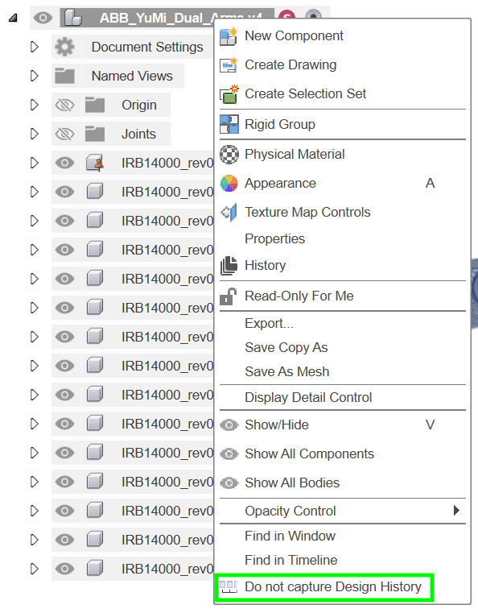
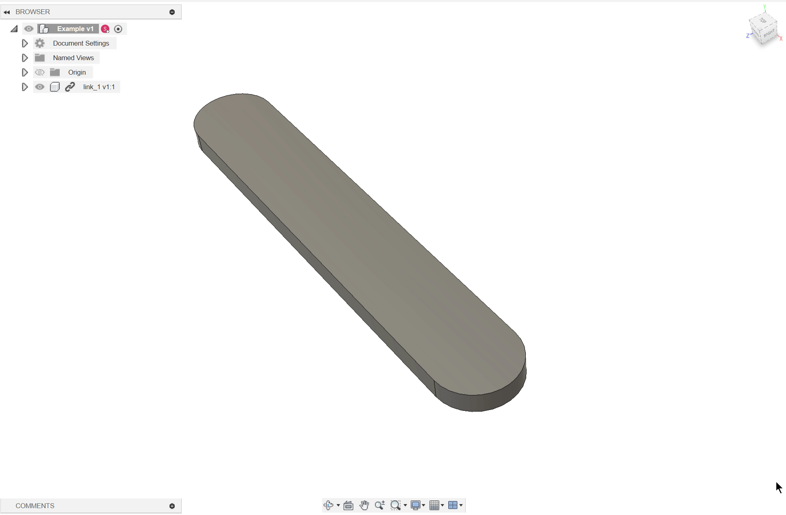
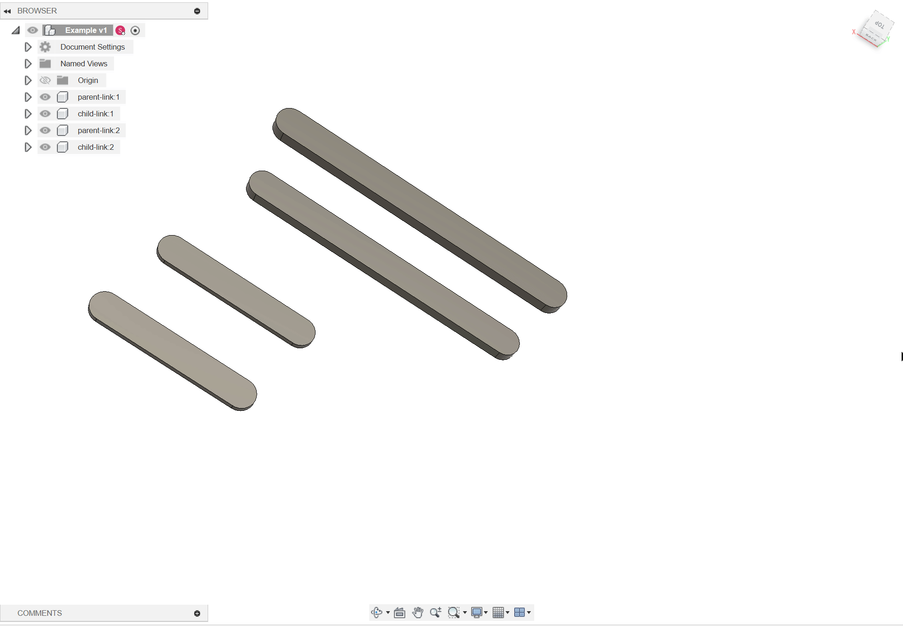
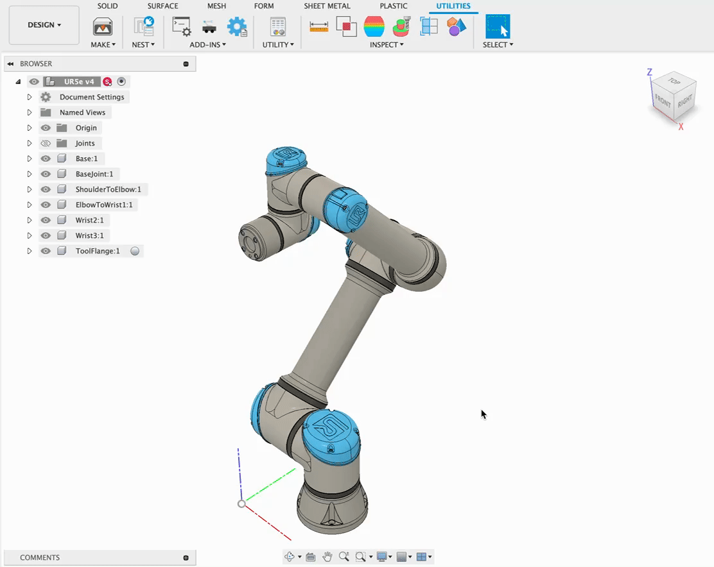
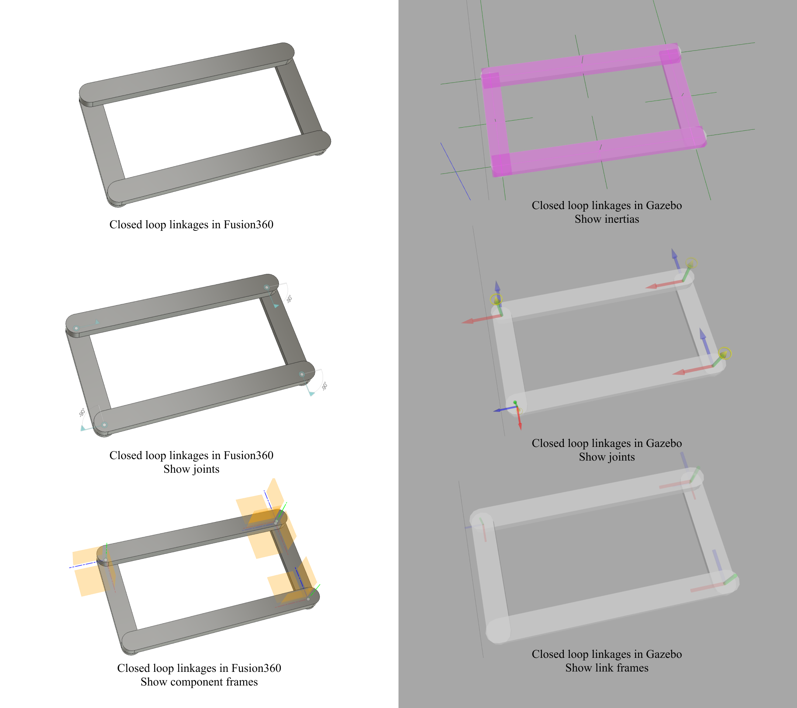
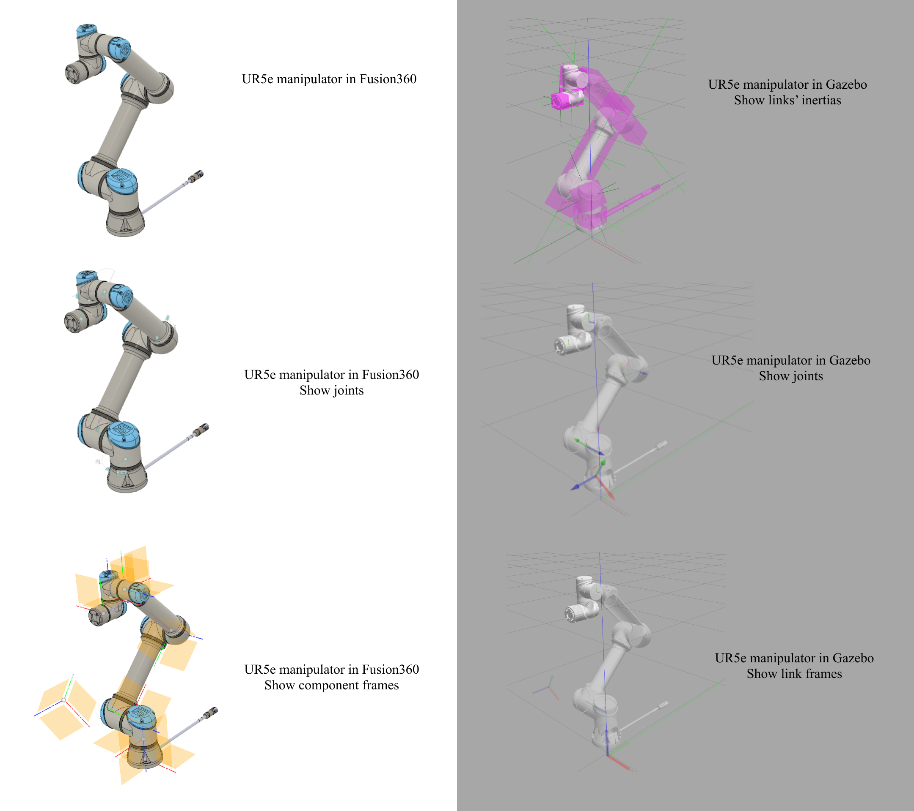
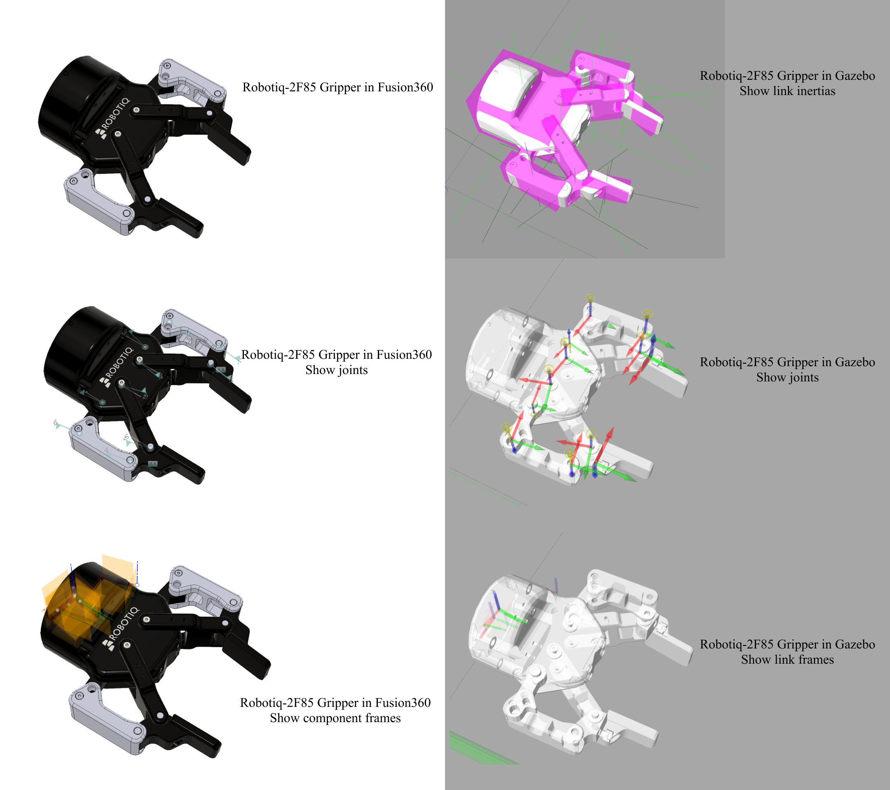

# ACDC4Robot: Automated Conversion of Description Conventions for Robots from Design to Learning

## Introduction
Robot description format (RDF) contains information about robot system model which is required by simulation, visualization, planning etc. In this project, we provide a Fusion360 Add-In for generating robot description files automatically from robot design. 

Currently, this Add-In supports exporting URDF and SDFormat. URDF (Unified Robotics Description Format) has been the most widely used robot description format, but has several limitations and lack of update. SDFormat (Simulation Description Format) has more features than URDF, such as supporting closed loop chain mechanism. Other robot description formats might be supported in the future.

## Features
Export robot descriptions files from Fusion360 design file directly with GUI panel.

- Support 3 Fusion360 joint motion types:
    - Fixed joint type
    - Revolute joint type with limitation
    - Slider joint type with limitation
- Supported robot description formats:
    - [URDF](http://wiki.ros.org/urdf/XML) (Unified Robotics Description Format)
    - [SDFormat](http://sdformat.org/spec) (Simulation Description Format) or SDF

## Installation
You can install this Add-In manually or by shell command.

### Manually Installation
Download and copy `/Add-IN/Fusion2Robot` folder into Fusion360's Add-in directory which should be:

Windows:
```
%appdata%\Autodesk\Autodesk Fusion 360\API\AddIns
```

Mac:
```
$HOME/Library/Application Support/Autodesk/Autodesk Fusion 360/API/AddIns
```
or it can be found at `Preferences -> General -> API -> Default Path for Scripts and Add-Ins`.

### Installation Using Shell Command
Windows (PowerShell):
```PowerShell
cd <path to /Add-In/Fusion2Robot>
Copy-Item ".\Fusion2Robot\" -Destination "${env:APPDATA}\Autodesk\Autodesk Fusion 360\API\AddIns\" -Recurse
```

macOS (Terminal):
```bash
cd <path to /Add-In/Fusion2Robot>
cp -r ./Fusion2Robot "$HOME/Library/Application Support/Autodesk/Autodesk Fusion 360/API/AddIns/"
```

### First Run
After installation for the first time, use `Shift+S` or click `UTILITIES -> Add-Ins -> Scripts and Add-Ins` to open `Scripts and Add-Ins` window.

Find `Fusion2Robot` at `Add-Ins -> My Add-Ins`, select `Fusion2Robot` and click `Run`(for normally use, please select `Run on Startup`). Then the icon will appear beside `UTILITIES -> Add-Ins icon`. 

Click the icon to start exporting process from the current design.


## Usage
### Before Using This Add-In
Before exporting robot description files, please follow the following instructions  to make sure the design file is suitable to execute this add-in. 

To prevent unexpected modification of the original design, it is better to run this add-in in a copy of the design file.

- Exit parametric mode: right click the root component of the design, choose `Do not capture Design History`

- Set the default unit of the design document to `m`

- Using `Break Link` to make *external component* into *internal component*

- Occurrences refer to the same component are not supported yet, use `Make Independent` to independ those occurrences.

- - Make sure all the components are named with alphanumeric characters, underscore character `_`, and hyphe character `-`. Other languages and characters might cause problems.
- - Components need to be joint together with a specific structure in order to export the robot description files properly. Please check the [instructions for Fusion360 Assembly](./InstructionsForAssembly.md).

### After Setting Up Design File
Click the add-in icon, then chose the robot description format and targeted simulation platform to export.


## Tested Examples
### Closed Chain Linkages
- Test a closed loop linkages in Gazebo to show the ability of SDFormat to describe a closed-chain mechanism


### Robot Manipulator: UR5e
- Test a UR5e manipulator in Gazebo


### Robot Gripper: Robotiq-2F85-Gripper
- Test Robotiq-2F85 Gripper in Gazebo


## Robot Database
We also provides some robot models that assembled by us, and tested the Add-In with these models.


## FAQ

## Citation

## Reference
- [Fusion2PyBullet](https://github.com/yanshil/Fusion2PyBullet)
- [fusion2urdf](https://github.com/syuntoku14/fusion2urdf)